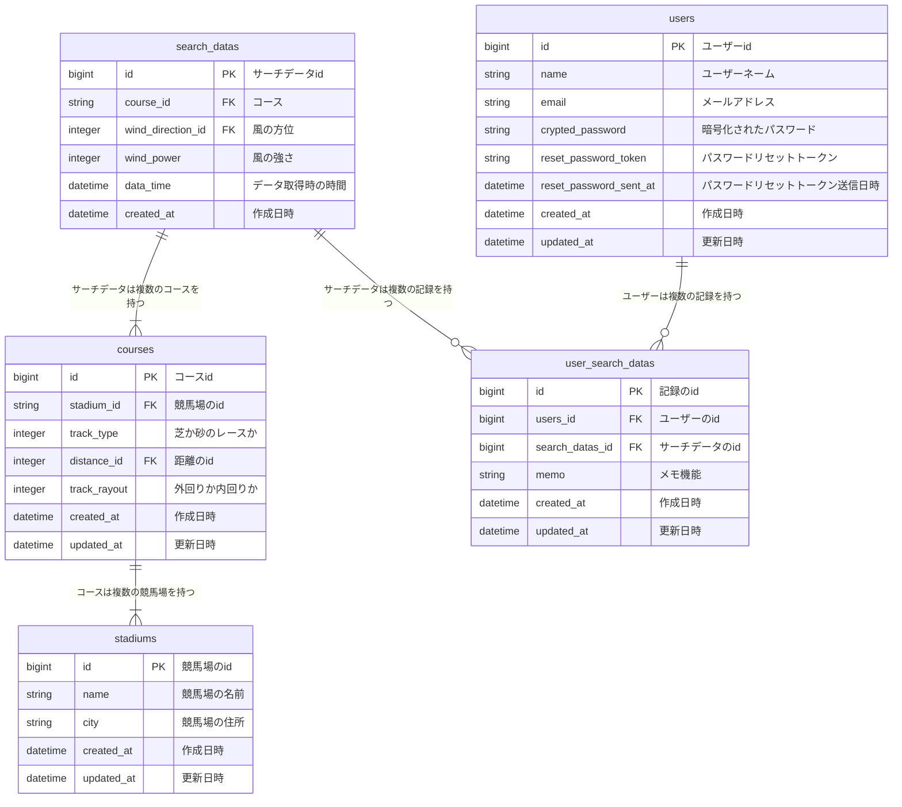

### ■サービス概要

レースが開催される競馬場のレース発走時間の風向きがわかる。

矢印で風向きを表示したい。(非同期で)

競馬の予想を行う上のファクターで風の強さが認められてきている為。

### ■このサービスへの思い・作りたい理由

**馬券に役立つ“風と馬との関係”**

https://news.netkeiba.com/?pid=news_view&no=243237

2024年中山牝馬S

https://www.jra.go.jp/JRADB/accessS.html?CNAME=pw01sde1006202402051120240309/9D

当日(15:00)の風向き、風の強さ等

https://tenki.jp/past/2024/03/09/amedas/3/15/45106.html

北北西 3,9m/s

競馬場のコース、風向き加味するとこのようになる。

https://gyazo.com/280b64670b74c5c955527aacead085d3

1番人気で負けてしまったフィアスプライド(9着)騎乗のルメール騎手のコメント

**フィアスプライド９着・ルメール騎手「ペースが遅かったので向正面でポジションを上げましたが、外を回ったうえに風の影響もあって疲れてしまいました。マイルのほうが良さそうです」**

現代の競馬でレースを予想するのに当たって、風の強さは重要なファクターになりつつある。

ただ問題があって、此方の画像は競馬場の上からの写真なのだが、どれも東西南北バラバラかつ、

コースレイアウトも違う。(画像以外にも6つ競馬場ある)

https://gyazo.com/184a0303c03d8f1b3d3d70eabd5235d9

あまり良くない感情かもしれないが、自分がめんどくさいと思ったのが最初の理由です。

家でPCの前ならまだしも出先でスマホで情報確認するために天気サイトみて、googleの地図アプリみて、

その競馬場のコースレイアウト確認する。

なまじこのファクター取り入れて、当たった経験があると無視するのは気持ち悪く感じる。

### ■ユーザー層について

競馬を自分で予想している層は、基本的に毎週競馬がある都合上、毎週使用してくれる。

パチスロとかと違って、わざわざ競馬を好んで行うこのユーザー層は自分で予想をすることに楽しみを見出してる。

ただお金を増やしたいのであればNISAやればいいですし。

だからこそこのITのご時世に未だに競馬新聞(情報源)があんなにまだ存続してる。

### ■サービスの利用イメージ

開催している競馬場(2か所or3か所)の中から知りたい競馬場をまず選択して、

次に知りたい時間を選択すると、コースのレイアウトと風向き、風速が出る。

それをファクターの一つとして予想するために使ってもらう。

拡張としてはユーザー登録することで、メモ機能みたいなので記録残せる。

このレース強風でこの馬には不利だったから次どこかのレースに出てきたら評価したい～みたいな。メモ残せるように。

### ■ユーザーの獲得について

https://otn.fujitv.co.jp/b_hp/100000096.html ここでバイトしているので、

担当Dとかスタッフとかに触ってもらおうと思っています。

twitterアカウントもあるのでそちらで拡散してもらうこともお願いするつもりです。

### ■サービスの差別化ポイント・推しポイント

https://keibatennki.jp/pc/index.php

有料会員登録じゃないと見れなそう。そもそも風の強さを3段階で評価して

あくまでこの風の情報などを元に、既に予想された情報を購入する形。

会員登録しないでも情報見れるようにする。

あくまで自分で予想してもらう。参考書の解答を見るんじゃなくて

自分で解いてもらうための公式を提供するイメージ。

ウマ娘等経由で競馬を知った人に自分で考えることの楽しさを知ってもらいたい。

### ■機能候補

★MVP時

2パターンサービスを用意して
1.開催競馬場(2場or3場)を入力して、現在時刻から一番直近時間のレースのコースレイアウトと風の向き強さの表示。(可能なら非同期処理)
2.開催競馬場(2場or3場)を入力して、一時間毎に時間を選べて選んだ時間の一番直近の時間のレースのコースレイアウトと風の向き強さの表示。(可能なら非同期処理)

9月頭MVPだとして、直近の開催競馬場が中山競馬場、中京競馬場なのでその2つのレイアウト＋風の情報みれる状況でリリース。

コースレイアウトに関しては、https://gyazo.com/e8a194f43f8a88b3ed9e3c11691f0ea5
公式のレイアウト画像をcanvaで加工して使用。
9月以降～仮にMVPだとして、
9月中山、中京実装。以降で東京、京都、新潟と順次実装を行う。

レース番号とコースの紐づけは最初は手打ちで実装。
後々は、https://race.netkeiba.com/top/?rf=navi
にスクレイピングして、データ取得を考えています。

★本リリーズ時

会員登録及び メモ機能及びLINE通知機能。

昨晩予想したレースが発走何分前ですよ。と通知出来るように。

### ■機能の実装方針予定

開発環境： Docker
サーバーサイド: Ruby on Rails 7系
Ruby 3.1.6  Rails 7.0.4.3
フロントエンド: Hotwire,React(本リリース実装予定),shadcn/ui(本リリース実装予定)
CSSフレームワーク: Tailwind CSS
WebAPI: 競馬場の位置情報取得 :Geocoder, 天気情報の取得 :OpenWeather, LINE通知 :LINE Messaging API(本リリース実装予定)
インフラ:
Webアプリケーションサーバ: Fly.io
ファイルサーバ: AWS S3
データベースサーバ: PostgreSQL

その他
VCS: GitHub
CI/CD: GitHubActions

## ■画面遷移図はこちら
[画面遷移図](https://www.figma.com/design/lvIulo0KmDCjKPaZjzSuNl/wind-horse?node-id=0-1&t=3WefSuGJgu3IIzvJ-1)

## ■ER図はこちら

