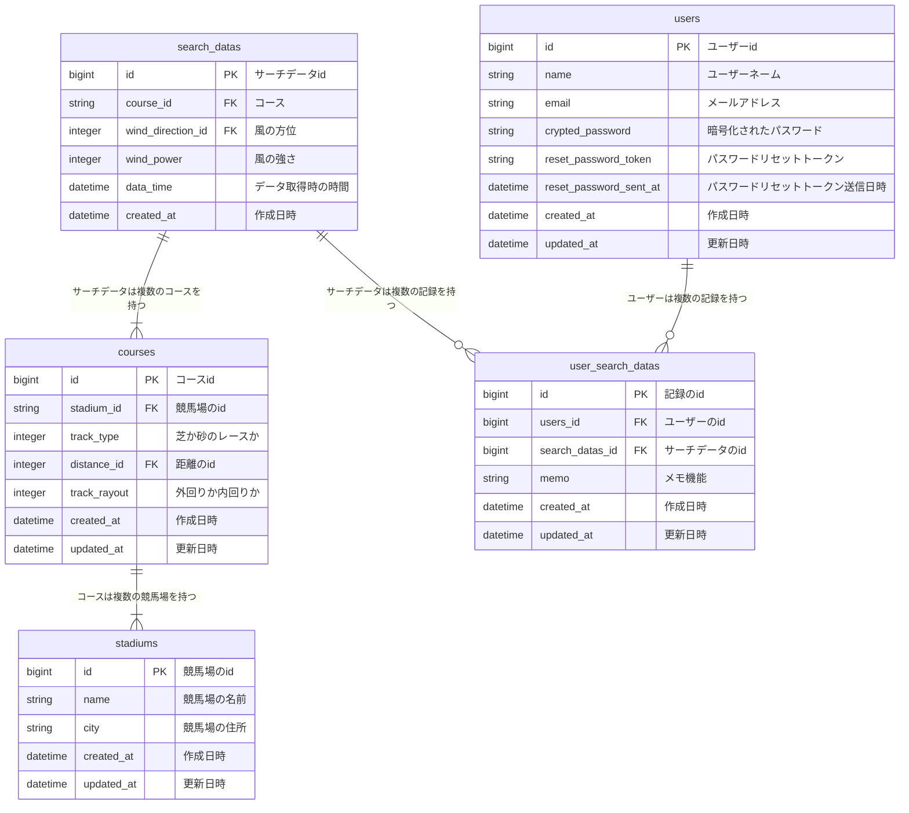

### ■サービス概要

レースが開催される競馬場の風の強さ、風の吹く方角がわかるアプリです。

### ■このサービスへの思い

近年、他のモータースポーツ等と同様に
競馬の競走においても風の影響というものが注目されつつあります。

自転車競技等で見られる風除けの文化が競馬でも取り入れられており、
海外ではここからここまでは向かい風で馬が消耗するから馬の後ろを走って風除けにしようと
オーダーがジョッキーにお願いされることも珍しくありません。

向かい風の中、全力疾走することを辛くないという人がいないように
馬も例外ではありません。

**馬券に役立つ“風と馬との関係”**

https://news.netkeiba.com/?pid=news_view&no=243237

2024年中山牝馬S

https://www.jra.go.jp/JRADB/accessS.html?CNAME=pw01sde1006202402051120240309/9D

当日(15:00)の風向き、風の強さ

https://tenki.jp/past/2024/03/09/amedas/3/15/45106.html

北北西 3,9m/s

競馬場のコース、風向き加味するとこのようになりまあす。

https://gyazo.com/280b64670b74c5c955527aacead085d3

1番人気で負けてしまったフィアスプライド(9着)騎乗のルメール騎手のコメント

**フィアスプライド９着・ルメール騎手「ペースが遅かったので向正面でポジションを上げましたが、外を回ったうえに風の影響もあって疲れてしまいました。マイルのほうが良さそうです」**

現代の競馬でレースを予想するのに当たって、風の強さは重要なファクターになりつつあります。

ただ問題があり、此方の画像は競馬場の航空写真なのですが、どれも東西南北バラバラかつ、

コースレイアウトも違います。(画像以外にも6つ競馬場ある)

https://gyazo.com/184a0303c03d8f1b3d3d70eabd5235d9

自分が風の影響を考えた時に、調べるのがめんどくさいと思ったのが最初の理由です。

家でPCの前ならまだなんとかなりますが
出先でスマホで情報確認するために天気サイトみて、googleの地図アプリみて、
その競馬場のコースレイアウト確認してと大変な手間がかかってしまいます。

### ■機能紹介

・ユーザー登録機能
・風の強さ、方角確認機能(対応競馬場:東京競馬場、京都競馬場、中山競馬場、新潟競馬場)

### ■開発環境

開発環境： Docker
サーバーサイド: Ruby on Rails 7系
Ruby 3.1.6  Rails 7.0.4.3
フロントエンド: javascript
CSSフレームワーク: Tailwind CSS
WebAPI:天気情報の取得 :OpenWeather
インフラ:
Webアプリケーションサーバ: render.com
データベースサーバ: PostgreSQL

その他
VCS: GitHub
CI/CD: GitHubActions

## ■画面遷移図はこちら
[画面遷移図](https://www.figma.com/design/lvIulo0KmDCjKPaZjzSuNl/wind-horse?node-id=0-1&t=3WefSuGJgu3IIzvJ-1)

## ■ER図はこちら

